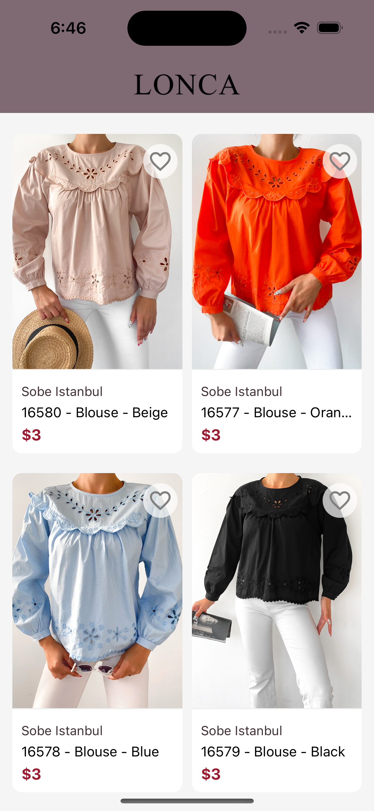
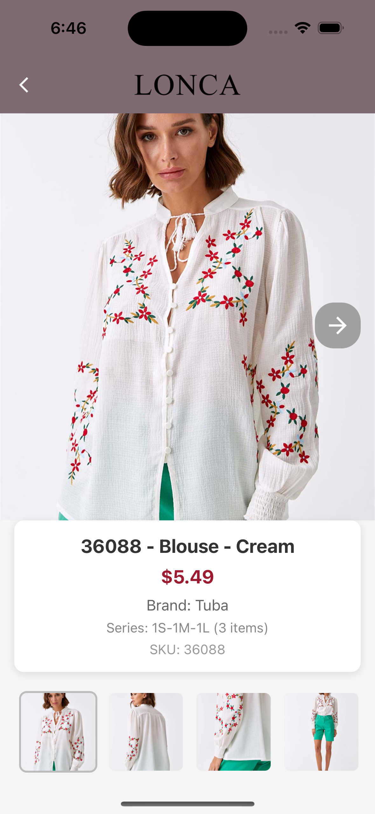
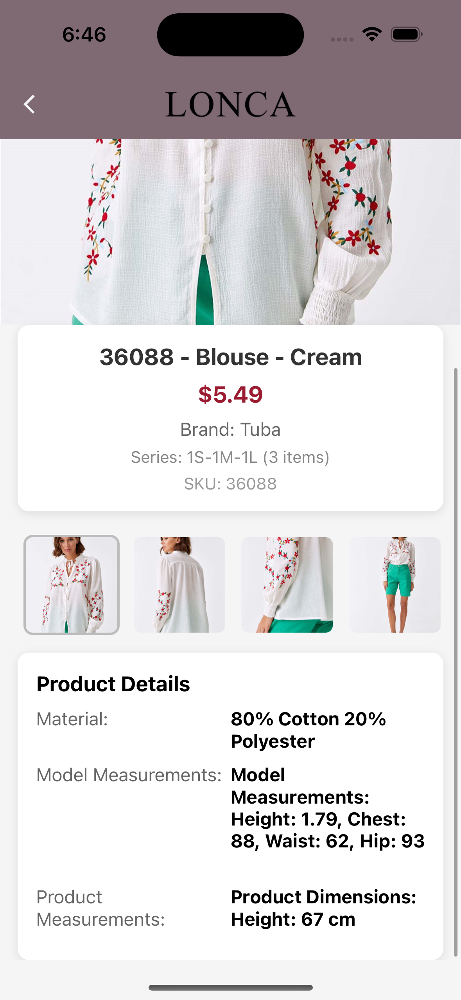

# Lonca Mobile App

**Lonca**, React Native ile geliştirilmiş, kullanıcıların ürünleri listeleyip detaylarını inceleyebileceği bir mobil uygulamadır. Uygulama, kullanıcı dostu bir arayüz ile modern bir alışveriş deneyimi sunar.

---

## 📱 **Uygulama Genel Özellikleri**

### **Ürün Listesi**
- Tüm ürünlerin kart formatında listelendiği bir ekran.
- **Kartlar:** Ürünün ana resmi, marka adı, ürün adı ve fiyat bilgisi yer alır.
- Kullanıcılar ürünleri aşağıya doğru kaydırarak (scroll) keşfedebilir.
- Favorilere ekleme özelliği.



### **Ürün Detay Ekranı**
- **Resim Galerisi:**
  - Ürünün ana resmi ve diğer resimleri arasında geçiş yapabilme.
  - İleri-geri butonları ve alt kısımda küçük resim galerisi.
- **Ürün Bilgileri:**
  - Ürün adı, fiyatı, marka adı, serisi ve SKU numarası.
- **Ürün Detayları:**
  - Materyal bilgisi (ör. %80 Pamuk, %20 Polyester).
  - Model ölçüleri (ör. Boy: 1.79, Göğüs: 88, Bel: 62, Kalça: 93).
  - Ürün boyutları (ör. Yükseklik: 67 cm).





### **Responsive tasarım**: Tüm ekran boyutlarına uyumlu.
- **Merkezi bir yapılandırma:**
  - Renk, yazı tipi, ekran boyutları ve API bilgileri gibi değişkenler `config.js` üzerinden yönetiliyor.
  - API anahtarları ve URL bilgileri `.env` dosyasıyla saklanıyor.


---

## 🛠 **Kullanılan Teknolojiler**

- **React Native (CLI):** Mobil uygulama geliştirme.
- **JavaScript:** Uygulama dili.
- **Axios:** Backend API ile veri alışverişi.
- **React Navigation:** Ekranlar arası geçiş.
- **Flexbox:** Responsive tasarım.

---

## 🔧 **Kurulum ve Çalıştırma**

### Gerekli Araçlar:
- Node.js: **v18.20.5**
- npm: **v10.8.2**
- React Native CLI: **15.0.1**
- Android Studio ve/veya Xcode

### Kurulum Adımları:

1. Projeyi klonlayın:
   ```bash
   git clone https://github.com/kullanici_adiniz/lonca.git
   cd lonca

## 🚀 **Uygulamayı Çalıştırma**

Uygulamayı iOS veya Android cihazlarda/simülatörlerde çalıştırmak için aşağıdaki adımları izleyin.

---

### **iOS için Uygulama Çalıştırma**

1. **Mac cihazınızda Xcode’u yükleyin ve gerekli yapılandırmaları yapın**:
   - Xcode yüklü değilse, (https://developer.apple.com/xcode/) indirebilirsiniz.
   - Gerekli komut satırı araçlarını yükleyin:
     ```bash
     xcode-select --install
     ```

2. **iOS simülatörünü başlatın**:
   - Xcode’da bir proje açın, "Simulator" menüsünden bir cihaz (örneğin, iPhone 14 Pro) seçin ve çalıştırın.

3. **Metro Bundler'ı başlatın**:
   - Proje dizininde yeni bir terminal açın ve şu komutu çalıştırın:
     ```bash
     npm start
     ```

4. **iOS uygulamasını çalıştırın**:
   - Metro Bundler çalışırken, başka bir terminalde şu komutu çalıştırın:
     ```bash
     npx react-native run-ios
     ```

5. **Değişiklikleri görmek için uygulamayı yeniden yükleyin**:
   - Kodda değişiklik yaptıktan sonra iOS simülatöründe <kbd>Cmd ⌘</kbd> + <kbd>R</kbd> tuşlarına basarak uygulamayı yeniden yükleyebilirsiniz.

---

### **Android için Uygulama Çalıştırma**

1. **Android Studio’yu yükleyin ve emülatör yapılandırmasını yapın**:
   - Android Studio yüklü değilse,(https://developer.android.com/studio) indirebilirsiniz.
   - SDK Manager’dan "Android SDK Tools" ve "Android Virtual Device (AVD)" yüklü olduğundan emin olun.
   - Bir emülatör oluşturun ve başlatın (örneğin, Pixel 5).

2. **Metro Bundler'ı başlatın**:
   - Proje dizininde yeni bir terminal açın ve şu komutu çalıştırın:
     ```bash
     npm start
     ```

3. **Android uygulamasını çalıştırın**:
   - Metro Bundler çalışırken, başka bir terminalde şu komutu çalıştırın:
     ```bash
     npx react-native run-android
     ```

4. **Değişiklikleri görmek için uygulamayı yeniden yükleyin**:
   - Android cihazda <kbd>R</kbd> tuşuna iki kez basarak uygulamayı yeniden yükleyebilirsiniz.

---
   
## 📂 **Proje Yapısı**

LONCAMOBILEAPP/
│
├── src/
│   ├── components/         # Reusable bileşenler (ör. Carousel, ProductCard)
│   ├── screens/            # Ekranlar (ProductList, ProductDetail vb.)
│   ├── config/             # Merkezi yapılandırmalar (renk, font, API bilgileri)
│   ├── services/           # API çağrıları
│
├── .env                    # Çevresel değişkenler
├── App.js                  # Ana uygulama dosyası
├── package.json            # Bağımlılık dosyası
└── README.md               # Proje dokümantasyonu


## 📝 **Notlar**

- **.env Dosyası**: Proje test edilebilmesi için `.env` dosyasında kullanılan **API_BASE_URL** ve diğer çevresel değişkenler gizlenmemiştir. Test sırasında herhangi bir ekstra ayar yapmanıza gerek yoktur. Ancak, üretim ortamında `.env` dosyası mutlaka **.gitignore** içine eklenerek gizlenmelidir.


